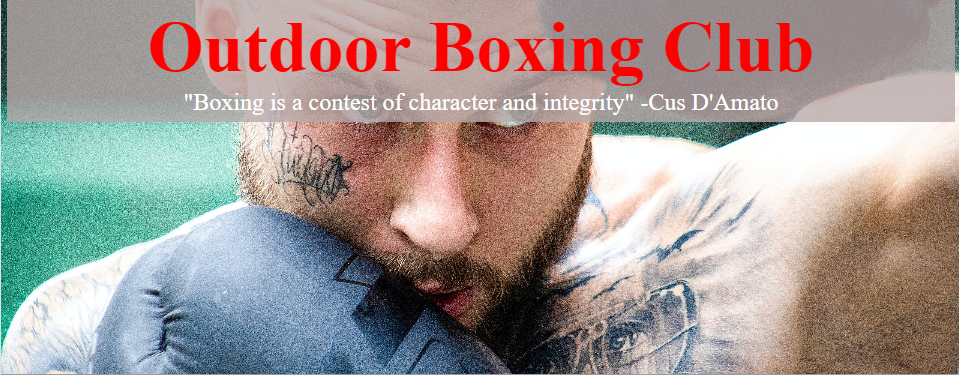
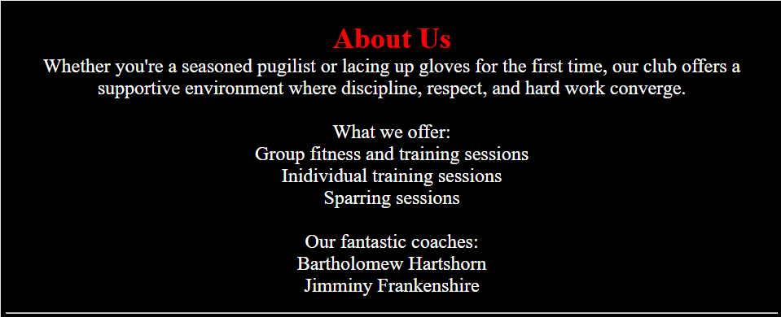
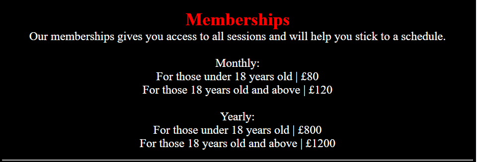
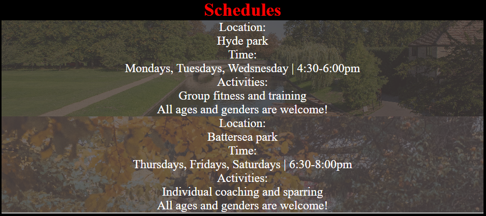
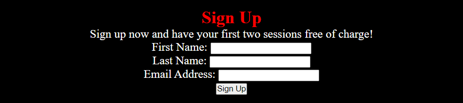

# Outdoor Boxing Club

Outdoor Boxing Club is a site that hopes to encourage people (living in London, England) to get into a fun outdoor fitness routine whilst also learning valuable boxing skills. This site will be useful for anyone with an interest in boxing as they can check what type of sessions will take place, the time it takes place and where it takes place.

## User Experience
### User Stories
1.As a user interested in a boxing or fitness club, I am expecting to see information about the club .
2.I expect to see what type of sessions will be available.
3.As someone who is looking to be trained, I expect to see who are the coaches.
4.As a user who is looking to join the club, I expect to be presented with the prices and options for payment.
5.I expect to see the time and locations of these boxing sessions as well as the activities being run for that day.
6.As a user looking to start attending the boxing club, i would like to have a way to sign up.
7.I expect to have different channels available to contact regarding any enquiries.
8.I would like to have access to social media accounts to get a preview of the boxing club.

## Design
### Wireframe
The wireframe created and used by me- [Wireframe](assets/readmepics/wireframe.png)

## Features

### Current Features
* #### Navagation Bar

    * The bar consists of 4 tabs which navigate to different sections of the page. This can help users easily find the section they find most useful.

* #### The landing image

    * The background image displaying a man boxing and contains overlapping text showing the name of the club as well as a quote. This makes the name clear and adds a design thats pleasing to the eye

  
* #### About Us section

    * This section summarises what we offer and who is in charge of the sessions by following two lists. It doesnt overload the users brain with information wnd uses simple language being accessible to people with a language barrier.

* #### Memberships section

    * To keep consistency for the user, the design for this section maintains the same styles as the previous section. Hopefully, this keeps the attention of the user as the content should be simple and fast to follow.

* #### Schedules section

    * Displays 2 boxes which seperate the information of the sessions. The location of the places where the sessions take place are in the back-ground offering more detail and context. All information needed to attend the sessions are listed over the images.

* #### Sign Up section

    * Form that requires first and last names to be filled out as well as an email. If part of the form is not filled a message will pop up notifying the user which helps prevent mistakes upon sign up.

* #### Footer

    * Contains icons that act as links to the social media. This leaves a simple and intuitive design. 
  
### Feature ideas to implement
* Purchasing on the site
* A public chatroom for members to talk within
* A rate and review section
  
## Testing

### Validator testing

* HTML has been validated using <https://validator.w3.org/nu/?doc=https%3A%2F%2Fbahraamk.github.io%2FOutdoorBoxingClub%2F> , no errors were found
* CSS has been validated using <https://jigsaw.w3.org/css-validator/validator?uri=https%3A%2F%2Fbahraamk.github.io%2FOutdoorBoxingClub%2F&profile=css3svg&usermedium=all&warning=1&vextwarning=&lang=en>, no errors were found

### Lighthouse testing
* The site scored 100 on mobile accessibility using [Pagespeed](https://pagespeed.web.dev/analysis/https-bahraamk-github-io-OutdoorBoxingClub/7se92wtugp?form_factor=mobile)
* The site scored 100 on desktop accessibility using[PageSpeed](https://pagespeed.web.dev/analysis/https-bahraamk-github-io-OutdoorBoxingClub/7se92wtugp?form_factor=desktopinsertlink)

### General testing
* I used the site on my Iphone and i sent the website to friends who used a Samsung to see if there were any unpredicted changes
* The site was refreshed and checked after each Git Commit

### Bugs
#### Known, Unfixed Bugs
* No known bugs that have not been fixed after testing

#### Fixed Bugs
* Users were able to submit the form without filling in all of the details. I fixed this by adding the required attribute to the end of each input element.
* The navigation bar would not change from its default color. I fixed this by targetting the list elements which were descendants of the div surrounding the text rather targetting the entire div element.

## Deployment

1. The deployment process for the site was to GitHub Pages and involves the following steps:
2. Go to the Settings tab within the GitHub repository.
3. Under the general settings, within the code and automation channel, select the pages tab.
4. Under the subheading "branch", select the main branch.
5. Besides the branch selection, select the folder icon then select the root folder.
6. Click the save button, refresh the page and wait a couple inutes to see the live site link towards the top of the page. 
Outdoor Boxing Club live link- <https://bahraamk.github.io/OutdoorBoxingClub/>

## Credits

### Content
* A small portion of the text was generated by [ChatGPT](https://chat.openai.com/)
* The code used for the wild card selector in the stylesheet was obtained from the [CI Love Running project](https://github.com/Code-Institute-Solutions/love-running-v3/blob/main/3.2-add-stylesheet-with-starter-styles/assets/css/style.css)
* All icons used within the webpage was obtained from [fontawesome](https://fontawesome.com/). Fontawesome does not require any credit to be given to the creators.
### Media
* All images used in the webpage was obtained from [Pexels](https://www.pexels.com/). Pexels does not require any credit to be given to the creators. 